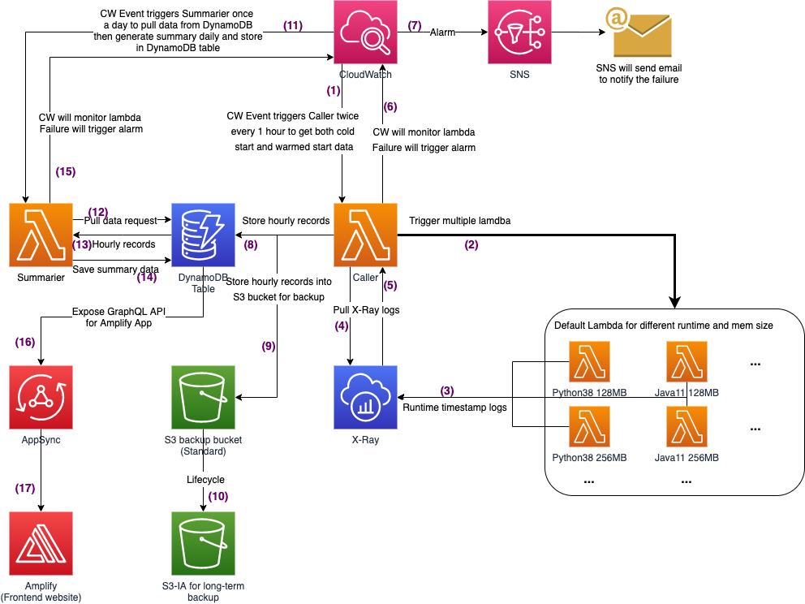

# Serverless Computation Cold Start Benchmark

## 1. Description
'Does serverless make sense?' I keep asking myself this question after spending lots of time reading about AWS Serverless infrastructure. Obviously there are massive exciting features Serverless provides to us, for example 'Pay as you go', 'Infra, Deployment, Config as(is) code', 'Elasticity', 'Business logic focusing' etc. etc. Exciting right? BUT, if read these words again and slower, I feel like someone is hiding something:

1. Pay as you go: Nobody says you will save money OK?
2. Infra, Deployment, Config as(is) code: Automation is great. But without Serverless we have bash right?
3. Elasticity: Oh BTW, there will be no elasticity if your function needs more than 5 mins. And, yes, sorry about that, if you have LSI enabled, your partition size should be no more than 10GB.
4. Business logic focusing: Ha! You think you could focuse 100% on your business logic if you migrate to Serverless? YOU ARE WRONG! Come and get your AWS Certs baby.

So, short answer to the question - "It depends." From the learning point of view, Serverless can abstract low-level structures to easily-understandable concepts. But at the same time, it also brings a new set of knowledge into learning scope. To better understand and remember those new rules, you still need to go deeper. From the business point of view, Serverless provides you lots of options, lots of designs. Everything has Pros and Cons. If you do not understand these details, you will get lots of pain or even worse. One of the most well known pain points of Serverless, on which I will focus in this project, is Lambda cold start latency. This could block latency-sensitive business usecases from being migrated onto Serverless.

To help myself better understand and experience Serverless, I plan to build a Serverless website on AWS. And this website will about Lambda cold start latency.

## 2. Design
### Overall design
1. Basically, the website is targeted to show and compare the time-related information of AWS Lambda, or Azure Functions, GCP Cloud Functions etc. For example, the time for cold start; the time for overhead (for manage system to prepare for the next call); and the overall latency between the initiation of a call and your function is actually started to execute.
2. The workload for tested function will be the default function provided by AWS. The default function does nothing but only return a 200 http status code and a string - 'Hello from Lambda!' in the response body. So remember, the workscope is also a very important variable in our scope. For example, the code size of interpreted language like python and nodejs, is very small compare to Java and dotNetCore.
3. Overall, the design has 2 parts. First part is data generator. It will call Lambdas/Functions and gather information. The second part is data visualizer. It will fetch the information and represent them on a front end website. 
4. All components is deployed by AWS CDK and will be serverless.

### Design details

1. CloudWatch scheduled event will call "Caller" function twice hourly. One for cold start and one for warmed start.
2. Caller will trigger bunch of Lambdas (Functions of other providers in the future) with different runtime/mem size.
3. Timestamp logs will be sent to X-Ray.
4. After triggering all testing functions, Caller pulls X-Ray logs.
5. Logs fetched by Caller.
6. If Caller failed for any reason, failure metrics will be generated to CloudWatch.
7. Failure metrics will trigger an alarm and this will send message to SNS topic to send an email to me.
8. If Caller succeeds, the timestamp data will be pushed to DynamoDB.
9. As a backup, the timestamp data will also be wrapped as Json file and stored in S3.
10. S3 Lifecycle will move the logs into S3-IA for long-term storage.
11. CloudWatch will have another scheduled event to call "Summarizer" daily.
12. Summarizer will fetch all hourly records generated by Caller in one day and generate a summary and save it in the same DynamoDB table.
13. Explained above.
14. Explained ablve.
15. Summarizer is also monitored by CW. Failure will trigger an email.
16. A GraphQL API will be exposed for front end website to gather information.
17. React-based website managed by Amplify.

## 3. Progress
- [x] Caller and test functions 
- [x] Summarizer
- [x] GraphQL API
- [ ] Front end website
- [ ] Add more runtimes in AWS
- [ ] Add Functions in Azure
- [ ] Add Functions in GCP